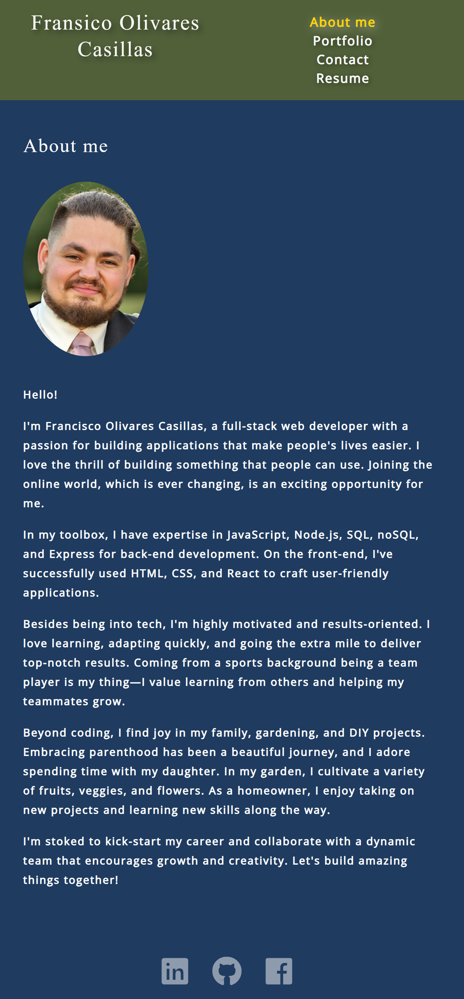
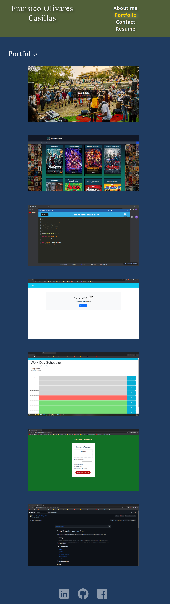
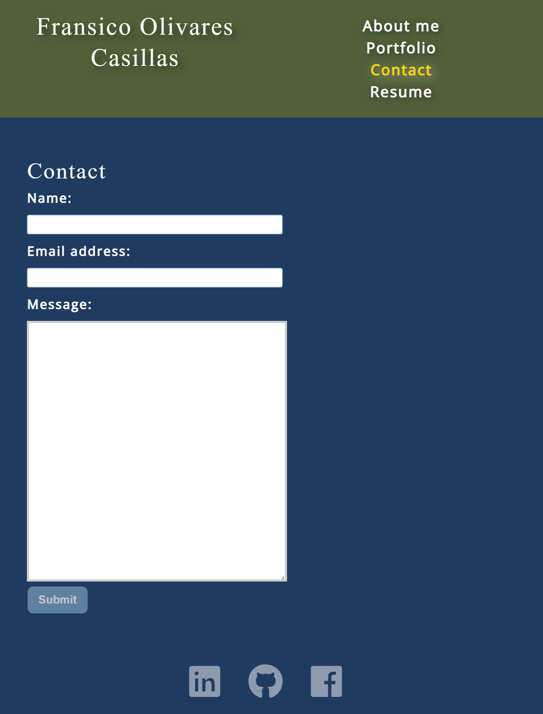
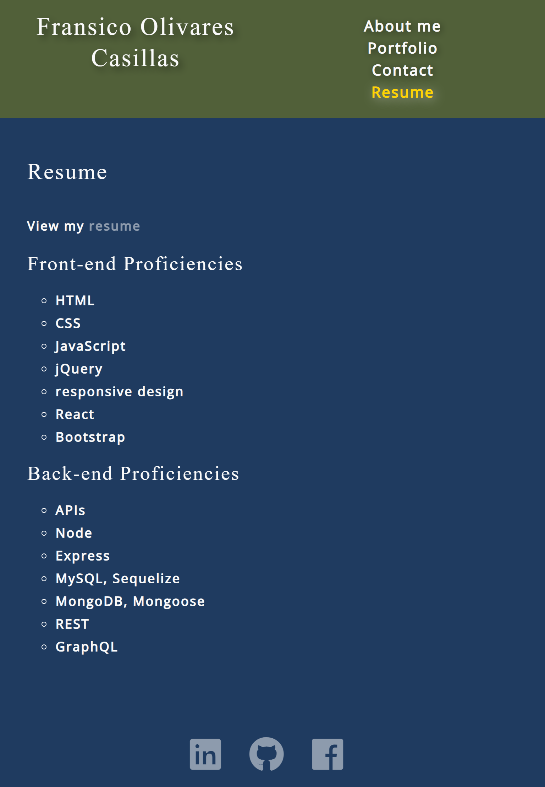

# Portfolio


## Description

I made this portfolio to showcase my projects as a webdeveloper in a more professional way

## Table of Contents

- [Installation](#installation)
- [Usage](#usage)
- [License](#license)
- [How to Contribute](#how-to-contribute)
- [Tests](#tests)
- [Questions](#questions)

## Installation

1. To install this portfolio you can clone this repository or download as a ZIP file

2. Go to the root directory of the project in the terminal

3. Run the following commands:

```
npm install 
```
```
npm start
```

4. The application will run automatically in http://localhost:3000/

## Usage

To use this application all you need to do is click on this [link](https://pacocasillas.github.io/Portfolio/) of the live application or follow the steps outlined in the [Installation](#installation) section

The following images show the look of the application:







## License

The license used in this project is: MIT License

## How to Contribute

N/A

## Tests

I made sure all the functionality works correctly

## Questions

Github profile: https://github.com/PacoCasillas

Please email any questions to: pacocasillasmx@gmail.com